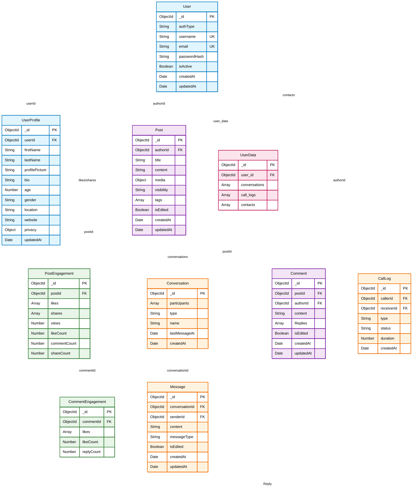
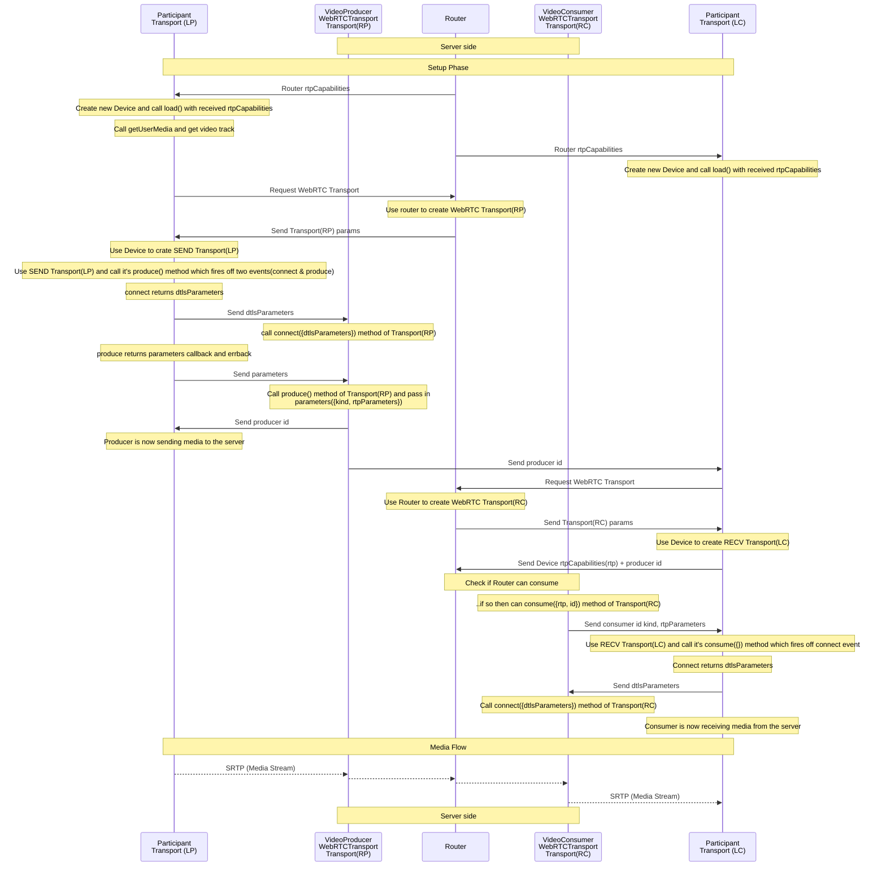

# Konect
> Konect is a social media platform to share pictures and stories. A place to chat with friends and face time them.

## High-Level Design

```mermaid
---
config:
  layout: dagre
  theme: dark
  look: neo
---
flowchart TB
subgraph konect["Konect"]
 subgraph WEB["Web Client<br>React"]
  end
 subgraph DNS["DNS"]
  end
 subgraph NGINX["Nginx Reverse Proxy<br>- Routing<br>- Rate Limiting"]
  end
 subgraph ClientServer["Client Server"]
  end
 subgraph subGraph3["Main Server"]
        API["REST API Server<br>Node.js/Express<br>- JWT Authentication<br>- Google OAuth<br>- Redis Caching"]
        SS["Session Management"]
        SIG["Signaling Server(WS)<br>-WebRTC Setup<br>"]
        AUTH["Authentication Service<br>- OAuth Provider<br>- JWT Management<br>- User Verification"]
        SFU["SFU Server<br>Mediasoup<br>- Video Routing<br>- Audio Routing"]
  end
 subgraph subGraph6["Data Layer"]
        MONGO[("MongoDB<br>- User Data<br>- Messages<br>- Posts<br>- Metadata<br>- Session Store")]
        REDIS[("Redis Server<br>- Rate Limiting<br>- Query Cache<br>- Pub/Sub<br>- WebSocket State")]
        S3[("S3 Object Store<br>- Profile Pictures<br>- Media Files<br>- Stories<br>- Post Attachments")]
  end
 subgraph subGraph7["External Services"]
        GOOGLE["Google OAuth 2.0<br>- User Authentication<br>- Profile Information"]
  end
 subgraph subGraph8["Cloud Infrastructure"]
        CDN["CDN"]
        MONITOR["Monitoring/Logs"]
  end
  end
    WEB --> NGINX & CDN & DNS & GOOGLE
    NGINX --> API & ClientServer
    API --> MONGO & REDIS & S3 & AUTH & MONITOR & SIG
    AUTH --> GOOGLE & SS & MONGO
    SS --> MONGO
    SIG --> SFU & REDIS & WEB
    SFU --> REDIS & WEB
    CDN --> S3
     MONGO:::Class_01
     REDIS:::Peach
     S3:::Rose
     WEB:::Rose
     NGINX:::Class_01
     DNS:::Peach
     konect:::Backdrop
     subGraph3:::Container
     subGraph6:::Container
     subGraph8:::Container
     subGraph7:::Container
     GOOGLE:::Google
     API:::Api
     AUTH:::Auth
     SS:::Ss
     SIG:::Auth
     SFU:::Ss
     CDN:::Ss
     MONITOR:::Api
     ClientServer:::Api
    classDef Rose stroke-width:1px, stroke-dasharray:none, stroke:#FF5978, fill:#FFDFE5, color:#8E2236
    classDef Pine stroke-width:1px, stroke-dasharray:none, stroke:#254336, fill:#27654A, color:#000000
    classDef Peach stroke-width:1px, stroke-dasharray:none, stroke:#FBB35A, fill:#FFEFDB, color:#8F632D
    classDef Class_01 fill:#C8F6C9, color:#000000, stroke:#259336
    classDef Google fill:#28c4E0, stroke:#2850F0, color:#000000
    classDef Backdrop fill:#000000
    classDef Api stroke:#F490F0
    classDef Auth stroke:#1AFF20
    classDef Container fill:#262626
    classDef Ss stroke:#FBF122
    linkStyle 0 stroke:#ffffff,stroke-width:1px,fill:none
    linkStyle 1 stroke:#ffffff,stroke-width:1px,fill:none
    linkStyle 2 stroke:#ffffff,stroke-width:1px,fill:none
    linkStyle 3 stroke:#ffffff,stroke-width:1px,fill:none
    linkStyle 4 stroke:#ffffff,stroke-width:1px,fill:none
    linkStyle 5 stroke:#ffffff,stroke-width:1px,fill:none
    linkStyle 6 stroke:#ffffff,stroke-width:1px,fill:none

```

## Database design

## How it started
> While studying backend designs I was introduced to WebRTC, a protocol which was especifically written for video/audio transmission over web-browsers. WebRTC provided Peer-To-Peer data transmission. I started building very basic versions of video calling web-apps. WebRTC wasn't just a protocol but a system of different protocols which predates WebRTC itself.
>
> After experimenting and reading a lot I decided to make use of it through some project work and what else comes to mind when thinking of connectivity and communication, a social networking platform.
> And "I wanted to learn frontend development too XD". I chose React.js for this because of it's simplicity and well documented guide.
> 
### Challenges
>
> Peer-To-Peer type communication is hard to establish without any knowledge of client address and configuration. WebRTC requires a Singalling server to initialise and communicate configurations.
>
> The system and network configurations were not enough to establish a p2p connection. Devices behind a private-addressess rquired NAT traversal or a mapping to tell where to send the packets.
> 
> This type of connection failed when the clients were behind a strict NAT type. So when some clients could connect with each other some were restricted by NAT rules and firewalls.
> 
> [WebRTC for the curious](https://webrtcforthecurious.com/) covers NAT traversal in great detail. This paper introduced me with a lot of networking challenges and eventually learning a lot more about media transmission.
>
> This was not enough for me to build the application. I was still in search of a good library which can handle request framing and capabilities to establish a WebRTC connection without writing some complex mechanisms like handling changes in network, video codecs, etc. which were out of my scope of learning.
>
> I kept sever logic and handling different video streams to myself. That is to build a SFU(Selective Forwarding unit). This is when I discovered [mediasoup](https://mediasoup.org/) a low level access to webRTC APIs. It was all I needed. It wasn't a magic black-box which just did the thing and wasn't like an arch machine where everyting had to be done manually.
>
> Using mediasoup I wrote my own video transmission server that managed video streams connections between several peers. Instead of p2p the video packets were going through my publicly deployed server which solved the issue of NAT traversal.

## Media transmission

### Moving forward
Now that I had a good feature to add in my project it still lacked the use of my frontend knowledge and an eager to design and build web-pages. With this idea of video calls I implemented live chatting along with a page to share pictures and stories.

This project wasn't just about building a web-application but it led me to read a lot of documents and papers to know what is going under the hood.

### How I ensured scalability
Testing your application's scalability without real world traffic or stress tests is like shooting arrows in the dark. Still, I could not pass the chance to build one. 
There were some checks I tried to ensure scalability
- Caching DB data and session keys.
- Uploading large files in parts(multipart uploads)
- Rate limitting at Reverse Proxy
- Object stores with CDNs.
   > So here I learned about two types of CDNs
   	- Pull CDN
   	- Push CDN
- Lazy loading media resources at the client side.
> I think I have missed some feature when I finished this project. Caching at server side was never implemented into the flow though the redis server was initialised. It was a time constraint due to exams coming up. I had already spent a lot of time studying webRTC and learning React.

## Why MongoDB
When building a consumer project data storage is one of the most important requirements. The flexibility offered by a non-RDBMS was helpful while developing the project where changes were common. Initially I had not planned what type of data will be stored since the idea was growing with the project. Having worked with MongoDB before I was confident with it's usage. Although I knew my project was not meant for a real world use with heavy traffic I still kept in mind scalability of data storage over cloud where non-RDBMS are easy to scale horizontally compared to RDBMS. 
MongoDB is a non-relational database. The schema less design was helpful to implement features later on 

