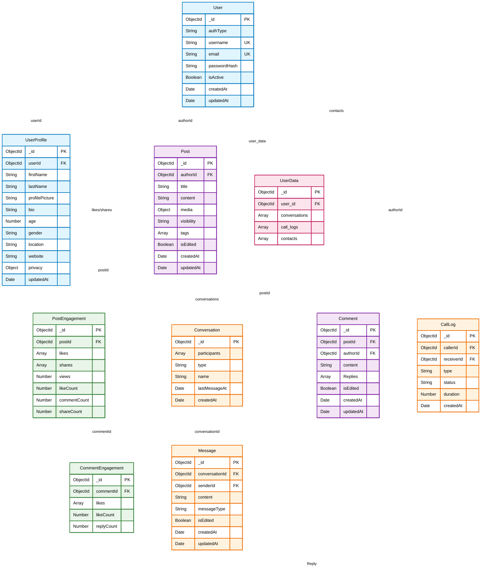

# Konect
> Konect is a social media platform to share pictures and stories. A place to chat with friends and face time them.

## Database design

```mermaid
%%{init: {
    'theme': 'base',
    'themeVariables': {
        'primaryColor': '#ffffff',
        'primaryTextColor': '#000000',
        'primaryBorderColor': '#000000',
        'lineColor': '#ffffff',
        'sectionBkgColor': '##E0E0E0',
        'altSectionBkgColor': '##E0E0E0',
        'gridColor': '#000000'
    }
}}%%
erDiagram
	direction TB
	User {
		ObjectId _id PK ""  
		String authType  ""  
		String username UK ""  
		String email UK ""  
		String passwordHash  ""  
		Boolean isActive  ""  
		Date createdAt  ""  
		Date updatedAt  ""  
	}

	UserProfile {
		ObjectId _id PK ""  
		ObjectId userId FK ""  
		String firstName  ""  
		String lastName  ""  
		String profilePicture  ""  
		String bio  ""  
		Number age  ""  
		String gender  ""  
		String location  ""  
		String website  ""  
		Object privacy  ""  
		Date updatedAt  ""  
	}

	Post {
		ObjectId _id PK ""  
		ObjectId authorId FK ""  
		String title  ""  
		String content  ""  
		Object media  ""  
		String visibility  ""  
		Array tags  ""  
		Boolean isEdited  ""  
		Date createdAt  ""  
		Date updatedAt  ""  
	}

	PostEngagement {
		ObjectId _id PK ""  
		ObjectId postId FK ""  
		Array likes  ""  
		Array shares  ""  
		Number views  ""  
		Number likeCount  ""  
		Number commentCount  ""  
		Number shareCount  ""  
	}

	Comment {
		ObjectId _id PK ""  
		ObjectId postId FK ""  
		ObjectId authorId FK ""  
		String content  ""  
		Array Replies  ""  
		Boolean isEdited  ""  
		Date createdAt  ""  
		Date updatedAt  ""  
	}

	CommentEngagement {
		ObjectId _id PK ""  
		ObjectId commentId FK ""  
		Array likes  ""  
		Number likeCount  ""  
		Number replyCount  ""  
	}

	Conversation {
		ObjectId _id PK ""  
		Array participants  ""  
		String type  ""  
		String name  ""  
		Date lastMessageAt  ""  
		Date createdAt  ""  
	}

	Message {
		ObjectId _id PK ""  
		ObjectId conversationId FK ""  
		ObjectId senderId FK ""  
		String content  ""  
		String messageType  ""   
		Boolean isEdited  ""  
		Date createdAt  ""  
		Date updatedAt  ""  
	}

	CallLog {
		ObjectId _id PK ""  
		ObjectId callerId FK ""  
		ObjectId receiverId FK ""  
		String type  ""  
		String status  ""  
		Number duration  ""  
		Date createdAt  ""  
	}

    UserData {
        ObjectId _id PK ""
        ObjectId user_id FK ""
        Array conversations
        Array call_logs ""
        Array contacts ""
    }


    User||--||UserData:"user_data"
    UserData||--o{User:"contacts"
	User||--||UserProfile:"userId"
	User||--o{Post:"authorId"
    UserData||--o{Conversation:"conversations"
	Post||--||PostEngagement:"postId"
	Post||--o{Comment:"postId"
	User||--o{Comment:"authorId"
	Comment||--||CommentEngagement:"commentId"
	Comment||--o{Comment:"Reply"
	%% User}o--o{Conversation:"participants"
	Conversation||--o{Message:"conversationId"
	%% User||--o{Message:"senderId"
	User}o--o{PostEngagement:"likes/shares"
	%% User}o--o{Message:"readBy"
	%% User||--o{Notification:"userId"
	%% User||--o{Notification:"actorId"
	UserData||--o{CallLog:"  "
	%% UserData||--o{CallLog:"receiverId"

%% Styling
    classDef userEntities fill:#e1f5fe,stroke:#0277bd,stroke-width:2px,color:#000
    classDef contentEntities fill:#f3e5f5,stroke:#7b1fa2,stroke-width:2px,color:#000
    classDef engagementEntities fill:#e8f5e8,stroke:#2e7d32,stroke-width:2px,color:#000
    classDef communicationEntities fill:#fff3e0,stroke:#ef6c00,stroke-width:2px,color:#000
    classDef dataEntities fill:#fce4ec,stroke:#c2185b,stroke-width:2px,color:#000
    
    class User,UserProfile userEntities
    class Post,Comment contentEntities
    class PostEngagement,CommentEngagement engagementEntities
    class Conversation,Message,CallLog communicationEntities
    class UserData dataEntities

```
## High-Level Design

```mermaid
---
config:
  layout: dagre
---
flowchart TB
 subgraph WEB["Web Client<br>React"]
  end
 subgraph NGINX["Nginx Reverse Proxy<br>- Routing<br>- Rate Limiting"]
  end
 subgraph DNS["DNS"]
  end
 subgraph subGraph3["Main Server"]
        API["REST API Server<br>Node.js/Express<br>- JWT Authentication<br>- Google OAuth<br>- Redis Caching"]
        SS["Session Management"]
        SIG["Signaling Server(WS)<br>-WebRTC Setup<br>"]
        AUTH["Authentication Service<br>- OAuth Provider<br>- JWT Management<br>- User Verification"]
        SFU["SFU Server<br>Mediasoup<br>- Video Routing<br>- Audio Routing"]
  end
 subgraph subGraph6["Data Layer"]
        MONGO[("MongoDB<br>- User Data<br>- Messages<br>- Posts<br>- Metadata<br>- Session Store")]
        REDIS[("Redis Server<br>- Rate Limiting<br>- Query Cache<br>- Pub/Sub<br>- WebSocket State")]
        S3[("S3 Object Store<br>- Profile Pictures<br>- Media Files<br>- Stories<br>- Post Attachments")]
  end
 subgraph subGraph7["External Services"]
        GOOGLE["Google OAuth 2.0<br>- User Authentication<br>- Profile Information"]
  end
 subgraph subGraph8["Cloud Infrastructure"]
        CDN["CDN"]
        MONITOR["Monitoring<br>CloudWatch/Datadog"]
  end
    WEB --> NGINX & CDN & DNS & GOOGLE
    NGINX --> API
    API --> MONGO & REDIS & S3 & AUTH & MONITOR & SIG
    AUTH --> GOOGLE & SS & MONGO
    SS --> MONGO
    SIG --> SFU & REDIS
    SFU --> REDIS & WEB
    CDN --> S3
    linkStyle 0 stroke:#ffffff,stroke-width:1px
linkStyle 1 stroke:#ffffff,stroke-width:1px
linkStyle 2 stroke:#ffffff,stroke-width:1px
linkStyle 3 stroke:#ffffff,stroke-width:1px
linkStyle 4 stroke:#ffffff,stroke-width:1px
linkStyle 5 stroke:#ffffff,stroke-width:1px
linkStyle 6 stroke:#ffffff,stroke-width:1px
     WEB:::Rose
     NGINX:::Class_01
     DNS:::Peach
     REDIS:::Peach
     MONGO:::Class_01
     S3:::Rose
    classDef Rose stroke-width:1px, stroke-dasharray:none, stroke:#FF5978, fill:#FFDFE5, color:#8E2236
    classDef Pine stroke-width:1px, stroke-dasharray:none, stroke:#254336, fill:#27654A, color:#000000
    classDef Peach stroke-width:1px, stroke-dasharray:none, stroke:#FBB35A, fill:#FFEFDB, color:#8F632D
    classDef Class_01 fill:#C8E6C9, color:#000000, stroke:#254336
    style subGraph3 fill:#000000
    style subGraph6 fill:#000000, color:#000000
    style subGraph8 fill:#BBDEFB, color:#000000
    style subGraph7 fill:#FFE0B2, color:#000000, strok:#FFE000

```
